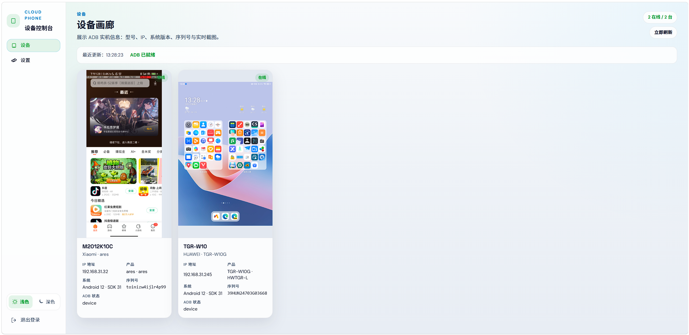
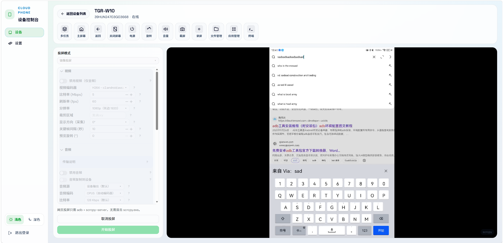
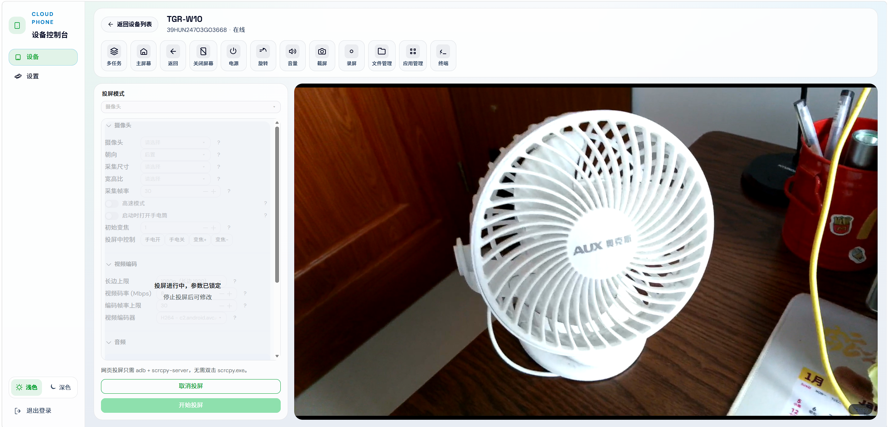
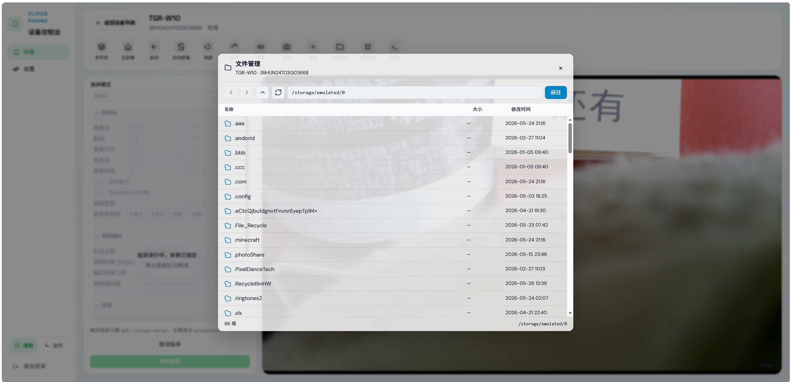
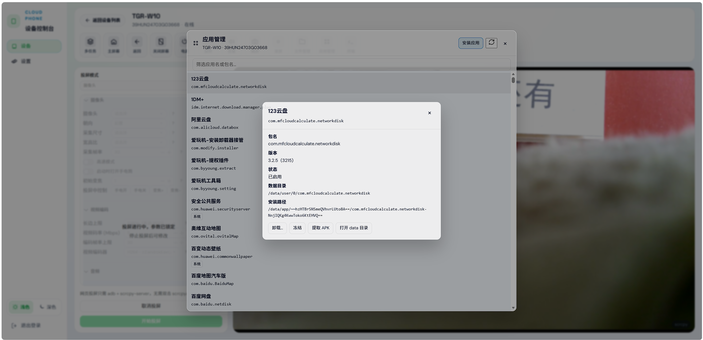
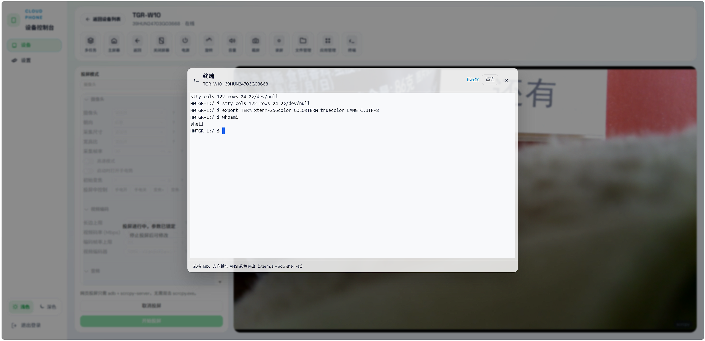

<div align="center">

# Cloud Phone

**用浏览器连真机：投屏、触控、文件、应用、终端，都在一个页面里。**

当前版本：**v0.10.4** · Node 后端 + Vue 3 前端 · 基于 [scrcpy](https://github.com/Genymobile/scrcpy) 4.0 自编译 WebSocket 投屏

[English](README.EN.md) · **中文**

</div>

---

## 相关链接

| 平台 | 地址 |
|------|------|
| **GitHub** | [github.com/yiyifred/Cloud-Phone](https://github.com/yiyifred/Cloud-Phone) |
| **Gitee** | [gitee.com/yiyifred/Cloud-Phone](https://gitee.com/yiyifred/Cloud-Phone) |
| **LINUX DO** | [linux.do](https://linux.do/) |

---

## 目录

- [相关链接](#相关链接)
- [为什么做这个项目](#为什么做这个项目)
- [亮点](#亮点)
- [截图（预留）](#截图预留)
- [功能一览](#功能一览)
- [快速开始](#快速开始)
- [目录结构](#目录结构)
- [API 摘要](#api-摘要)
- [构建 scrcpy](#构建-scrcpy)
- [环境变量](#环境变量)
- [社区准则](#社区准则)
- [致谢](#致谢)
- [赞助](#赞助)
- [English](README.EN.md)

---

## 为什么做这个项目

手里连着几台 Android 调试机，经常要在电脑上改配置、装包、看日志。命令行 `adb` 够用，但投屏参数一长串就烦；桌面版 scrcpy 很强，可我想在**浏览器**里统一管设备列表、投屏、文件和应用。

Cloud Phone 就是把这件事做成一个本地 Web 控制台：后端用内置 ADB + 改过的 scrcpy-server 推流，前端用 WebCodecs 解码 H.264，协议对齐 [ws-scrcpy](https://github.com/NetrisTV/ws-scrcpy)。镜像参数面板参考了 [escrcpy](https://github.com/viarotel-org/escrcpy) 的分组习惯，但代码是本仓库自己写的，不依赖 escrcpy 运行时。

**适合谁用**

- 需要可调编码器、虚拟屏、摄像头投屏、录屏的人
- 想在同一界面里顺便开文件管理、应用管理、Shell 的人

---

## 亮点

| 点 | 说明 |
|---|---|
| **浏览器投屏** | H.264 经 WebSocket 推到画布，WebCodecs 硬解；触摸/鼠标按 scrcpy 4.0 协议注入 |
| **官方 4.0 底座** | 在 `backend/source/scrcpy` 上移植 WebSocket，server 版本与桌面客户端一致，避免 jar 版本打架 |
| **参数够全** | 镜像：裁剪、采集方向、虚拟屏预设、音频源/编码器、关屏保活等；摄像头模式：手电、变焦（Android 12+） |
| **不投屏也能干活** | 文件管理、应用管理、ADB 终端、画廊截屏——设备在线即可，不必先开 cast |
| **投屏顶栏顺手** | 多任务/主屏/返回/电源/音量/旋转/剪贴板/录屏/截屏；导航键支持按住与手机同步 |
| **交互更统一** | 常用图标迁移 Lucide 图标库，统一线稿风格；补充焦点可见态与 hover 反馈 |
| **一键开发** | 根目录 `npm run dev` 先等后端 `/health` 再起 Vite，代理失败有明确提示 |
| **主题** | 左下角浅色/深色切换，偏好写本地 |
| **多语言** | 设置页切换界面语言（简中 / English / 繁中 / 日本語 / 한국어），核心界面即时切换 |
| **API 安全** | 登录后会话鉴权；JSON 接口 AES-GCM 加密；WebSocket 需有效会话 |
| **设备入口** | 画廊右上角提供「添加设备」弹窗；安卓 USB 提供连接引导（动画 + 实时状态），鸿蒙/苹果暂未开发 |

---

## 截图

| 位置 | 建议文件名 | 放什么 |
|---|---|---|
| 设备画廊 | `images/readme/gallery.png` | 多设备卡片、在线数、实时截图 |
| 镜像投屏 | `images/readme/mirror-cast.png` | 左侧参数 + 右侧画面 + 顶栏 |
| 摄像头投屏 | `images/readme/camera-cast.png` | 摄像头模式与手电/变焦 |
| 文件管理 | `images/readme/files.png` | 地址栏、目录列表 |
| 应用管理 | `images/readme/apps.png` | 应用列表与详情弹窗 |
| 终端 | `images/readme/terminal.png` | xterm 彩色 Shell |

```text
images/readme/
├── gallery.png
├── mirror-cast.png
├── camera-cast.png
├── files.png
├── apps.png
└── terminal.png
```

图片已插入到下方对应功能小节中；这里仅列出文件名与建议用途。

---

## 功能一览

### 设备画廊



- 左侧 Tab：**设备**、**设置**
- 自动发现 ADB 设备（内置 `platform-tools`），展示型号、厂商、IP、Android 版本、序列号、产品名
- 每台设备约 **5 秒**刷新截图（可调），列表约 **1 秒**刷新；刷新时保留上一帧，不闪全屏 loading
- 汇总在线/离线数量、最近刷新时间，支持手动刷新
- 点击卡片进入**设备工作区**

### 设置与登录

- 设置页横向布局，左侧二级菜单：**账号**（会话/改密）、**外观**（语言/主题）、**刷新**（列表与截图间隔）
- **界面语言**：简体中文、English、繁體中文、日本語、한국어（外观分类，偏好本地保存）
- 会话登录（默认密码 `admin`，首次使用请改密）；账号分类可修改密码、查看会话过期时间
- 浅色/深色主题在外观分类中切换，偏好持久化

### 设备工作区 · 镜像投屏（默认）



**左侧参数**（Naive UI 折叠分组；下拉带顶部搜索 `MirrorSearchableSelect`）：

| 分组 | 能力 |
|---|---|
| **视频** | 分辨率（长边）、码率、帧率、编码器（设备 `list_encoders`，超时回退通用列表）、采集方向、预览旋转（仅浏览器侧） |
| **音频** | 开关、音频源、`audio-code`、码率、`audio-dup`（Android 13+）；可「禁用视频」仅音频（画布波形 + PCM，Android 11+） |
| **设备** | 显示 ID、关屏投屏、保持唤醒、显示触摸点、关屏超时等 |
| **屏幕** | 虚拟屏预设、`--new-display` 自定义分辨率/DPI、`--flex-display`、IME 策略、系统装饰；`--start-app` 在虚拟屏上启动应用 |

**投屏过程**

- `POST .../cast/start` 启动；浏览器连 `WebSocket .../cast/ws`
- 设备端自编译 **scrcpy-server 4.0**（缺 jar 时后端 Gradle 自动编译）；启动前 `pkill` 残留进程，避免 **8886** 占用
- 参数经 WebSocket **type 101** 热更新（`codecOptions` / stream extras）；投屏中会锁定左侧表单，防止误改
- 画布触控：坐标按**解码后视频尺寸**映射（与 server `PositionMapper` 一致）；鼠标悬停/按下/拖动/抬起走 scrcpy SDK 协议

**顶栏控制**（图标上图标下文字，Lucide 风格）

- 多任务、主屏幕、返回、关闭屏幕、电源、旋转（同步左侧「预览旋转」+90°）
- 音量：点击展开「增加 / 减小」
- 剪贴板：粘贴到设备 / 从设备复制；支持文本输入框发字
- 截屏：下载 PNG（可不投屏）；投屏时画布四边白光闪烁反馈
- 录屏：有画面存 **MP4**，仅音频存 **MP3**；结束投屏自动保存
- **文件管理**、**应用管理**、**终端**：见下文（无需正在投屏）

### 设备工作区 · 摄像头投屏（Android 12+）



- 左侧「摄像头」：朝向、摄像头 ID、采集尺寸、宽高比、帧率、高速模式、手电筒、变焦、编码与音频
- `GET /api/devices/:serial/cameras` 列出设备摄像头
- 投屏中可开关手电、变焦；**摄像头模式不注入画布触摸**（避免误触）

### 文件管理



- 根目录 `/`，默认打开 `/storage/emulated/0`；地址栏显示真实绝对路径
- 后退 / 前进 / 向上 / 刷新；无权限时提示「权限不足」
- **上传**：将本地文件推到当前目录（`PUT .../files/upload?path=`）
- **下载**：将设备上的文件保存到电脑（`GET .../files/download?path=`）
- `GET /api/devices/:serial/files?path=...` 列出目录

### 应用管理



- 列表：应用名（经 scrcpy-server `PackageManager` 取 label）、包名、系统/冻结标记
- 详情弹窗：版本、SDK、数据目录等
- 卸载（二次确认）、用户级冻结/解冻、导出 APK、在文件管理中打开 `dataDir`
- 本地上传 APK 安装：`PUT .../apps/install`

### 终端



- xterm.js：Tab、方向键、ANSI 彩色；自动 `stty` 行列
- `WebSocket .../terminal/ws` 桥接 `adb shell -tt`

### 后端与其他

- `GET /health`、`GET /api/devices`、`GET .../screenshot`
- scrcpy 会话 API：`/api/scrcpy/*`（能力查询、会话启停，供脚本集成）
- 工具：`tools/build-scrcpy-server.mjs`、`build-scrcpy.mjs`、`download-scrcpy.mjs`、`sync-scrcpy-source.mjs`、`test-scrcpy-cast.mjs`
- 已移除 OTG / UHID 投屏模式；当前仅**镜像**与**摄像头**

更细的版本记录见 [CHANGELOG.md](CHANGELOG.md)。

---

## 快速开始

**环境**：Node.js 18+、已授权 ADB 的 Android 设备、支持 WebCodecs 的 Chromium 系浏览器（Chrome / Edge 等）。

**自动安装（命令行伪图形向导）**：

| 系统 | 命令 |
|------|------|
| Linux（Debian/Ubuntu/Alpine/Fedora/Arch 等） | `bash scripts/install-linux.sh` |
| macOS | `bash scripts/install-macos.sh` |
| Windows | `powershell -ExecutionPolicy Bypass -File scripts/install-windows.ps1` |
| Unix 自动分流 | `bash scripts/install.sh` |

```powershell
# 克隆后
cd Cloud-Phone
copy .env.example .env   # 按需改端口

# 推荐：根目录一键启动（先后端、再前端）
npm run dev

# 浏览器打开 http://localhost:5173（以 .env 中 FRONTEND_PORT 为准）
```

分开启动：

```powershell
npm run dev:backend   # 默认 3000
npm run dev:frontend  # 默认 5173
```

生产预览：

```powershell
cd frontend/web
npm run start   # build 后托管 dist/
```

首次投屏若提示 server 未编译，需 **JDK 17+** 与 Android SDK，执行：

```powershell
node tools/build-scrcpy-server.mjs
```

---

## 目录结构

```text
Cloud-Phone/
├── scripts/               # 三平台自动安装向导（install-linux/macos/windows）
├── backend/node/          # Node HTTP + WebSocket API
├── backend/source/scrcpy/ # scrcpy 4.0 源码 + WebSocket 改造
├── backend/bin/           # adb、scrcpy 预编译产物
├── frontend/web/          # Vue 3 + Vite + Naive UI
├── tools/                 # 构建、同步、开发启动脚本
├── images/qr/             # 赞助二维码
└── CHANGELOG.md
```

---

## API 摘要

除 `GET /api/auth/session`、`POST /api/auth/login`、`POST /api/auth/change-password` 外，均需先登录（会话 Cookie）。登录后 JSON 请求/响应使用 AES-256-GCM 加密；WebSocket 升级需有效会话；大文件/APK 上传为 `PUT` 二进制流（仅鉴权，响应 JSON 仍加密）。

| 方法 | 路径 | 说明 |
|---|---|---|
| GET | `/health` | 健康检查 |
| GET | `/api/devices` | 设备列表 |
| GET | `/api/devices/:serial/screenshot` | 设备截图 |
| GET | `/api/devices/:serial/mirror-options` | 镜像选项（显示器、应用等） |
| GET | `/api/devices/:serial/video-encoders` | 音视频编码器列表 |
| GET | `/api/devices/:serial/cameras` | 摄像头列表 |
| GET | `/api/devices/:serial/files?path=` | 目录列表 |
| GET | `/api/devices/:serial/files/download?path=` | 下载文件 |
| PUT | `/api/devices/:serial/files/upload?path=` | 上传到设备 |
| GET/DELETE | `/api/devices/:serial/apps` | 应用列表 / 卸载 |
| GET | `/api/devices/:serial/apps/:pkg` | 应用详情 |
| POST | `/api/devices/:serial/apps/:pkg/state` | 冻结/解冻 |
| GET | `/api/devices/:serial/apps/:pkg/apk` | 导出 APK |
| PUT | `/api/devices/:serial/apps/install` | 安装 APK |
| POST/DELETE | `/api/devices/:serial/cast/start\|stop` | 投屏会话 |
| WS | `/api/devices/:serial/cast/ws` | 投屏流 + 控制 |
| WS | `/api/devices/:serial/terminal/ws` | ADB Shell |
| * | `/api/scrcpy/*` | scrcpy 会话与能力（见 `backend/source/scrcpy/CLOUD_PHONE.md`） |

---

## 构建 scrcpy

**Web 投屏**依赖魔改 `scrcpy-server`（与 Windows/Linux/macOS 无关，但须在任一系统上用 Gradle 编出）：

```powershell
# 魔改 server（当前系统需 JDK 17+、Android SDK）
node tools/build-scrcpy-server.mjs

# 同时写入 backend/bin/scrcpy/windows|linux|macos/（跨平台部署推荐）
node tools/build-scrcpy-server.mjs --all-platforms
```

**Linux / macOS** 上若只跑 Node 后端 + 浏览器，执行 `--all-platforms` 即可；**不必**在本机再编 scrcpy 客户端。

可选：在本机用 Meson 编译 **scrcpy 桌面客户端**（会捆绑魔改 server，不再使用官方 `install_release.sh`）：

```powershell
node tools/build-scrcpy.mjs              # 需 meson + ninja；否则仅编 server
node tools/build-scrcpy.mjs --server-only

# 勿用于 Web 投屏：官方预编译，server 无 WebSocket 魔改
# node tools/build-scrcpy.mjs --download
```

```powershell
node tools/sync-scrcpy-source.mjs   # 从上游同步源码（需自行合并魔改）
```

详见 [backend/source/scrcpy/CLOUD_PHONE.md](backend/source/scrcpy/CLOUD_PHONE.md)。

---

## 环境变量

根目录 `.env`（参考 `.env.example`）：

| 变量 | 含义 | 默认 |
|---|---|---|
| `HOST` | 监听地址 | `0.0.0.0` |
| `BACKEND_PORT` | 后端 API | `3000` |
| `FRONTEND_PORT` | Vite 开发端口 | `5173` |


---

## 致谢

Cloud Phone 站在很多优秀项目肩上，特此感谢（排名不分先后）：

| 项目 | 用途 | 链接 |
|---|---|---|
| **scrcpy** | 屏幕/摄像头采集、编码、控制的核心；本仓库 `backend/source/scrcpy` 在其 4.0 上扩展 WebSocket | https://github.com/Genymobile/scrcpy |
| **ws-scrcpy** | 浏览器 WebSocket 线协议（`scrcpy_initial`、Annex-B H.264、type 101 等）参考 | https://github.com/NetrisTV/ws-scrcpy |
| **escrcpy** | 镜像参数分组与选项命名习惯的参考（非代码依赖） | https://github.com/viarotel-org/escrcpy |
| **Vue** | 前端框架 | https://github.com/vuejs/core |
| **Vite** | 构建与开发服务器 | https://github.com/vitejs/vite |
| **Naive UI** | 组件库 | https://github.com/tusen-ai/naive-ui |
| **xterm.js** | 终端模拟 | https://github.com/xtermjs/xterm.js |
| **lamejs**（@breezystack/lamejs） | 投屏录屏 MP3 编码 | https://github.com/breezystack/lamejs |
| **ws** | Node WebSocket | https://github.com/websockets/ws |
| **Java-WebSocket** | 设备端 WebSocket（scrcpy-server 依赖） | https://github.com/TooTallNate/Java-WebSocket |
| **Android platform-tools** | 内置 ADB | https://developer.android.com/tools/releases/platform-tools |

浏览器侧还用到 **WebCodecs**、**Web Audio** 等标准 API。

scrcpy 本体遵循 **Apache License 2.0**（见 `backend/source/scrcpy/LICENSE`）。若你发现遗漏了应署名的依赖，欢迎提 Issue。

---

## 赞助

如果 Cloud Phone 帮你省了时间，欢迎请我喝杯咖啡。扫码即是对项目的认可，金额随意。

<table align="center">
<tr>
<td align="center"><b>微信</b><br/></td>
<td align="center"><b>支付宝</b><br/></td>
</tr>
</table>

赞助自愿、非商业捆绑；项目仍完全开源，不影响你自行部署使用。

---


## Star History

<a href="https://www.star-history.com/?repos=yiyifred%2FCloud-Phone&type=date&legend=top-left">
 <picture>
   <source media="(prefers-color-scheme: dark)" srcset="https://api.star-history.com/chart?repos=yiyifred/Cloud-Phone&type=date&theme=dark&legend=top-left" />
   <source media="(prefers-color-scheme: light)" srcset="https://api.star-history.com/chart?repos=yiyifred/Cloud-Phone&type=date&legend=top-left" />
   
 </picture>
</a>
